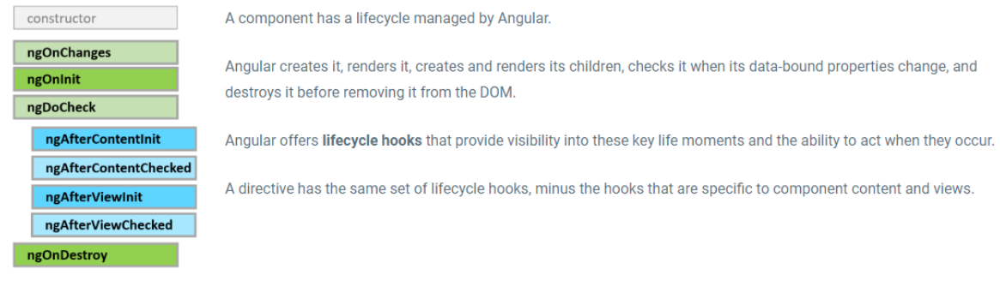

# Angular Lifecycle Hooks Interview Questions & Answers 🔄

> Comprehensive collection of Angular lifecycle hooks interview questions and answers for frontend developers. Covering component lifecycle, hook execution order, and best practices.

## 📋 Table of Contents

- [Lifecycle Hooks Overview](#lifecycle-hooks-overview)
- [Hook Execution Order](#hook-execution-order)
- [Individual Hook Details](#individual-hook-details)
- [Best Practices](#best-practices)
- [Common Interview Questions](#common-interview-questions)

---

## 🔄 Lifecycle Hooks Overview

### Q1: What are Angular Lifecycle Hooks and why are they important?

**Answer:**
Angular Lifecycle Hooks are special methods that Angular calls at specific moments in a component's lifecycle. They allow developers to tap into key moments in the component's life, from creation to destruction, enabling proper initialization, cleanup, and data management.

**Key Benefits:**

- **Initialization**: Set up component data and dependencies
- **Cleanup**: Prevent memory leaks by unsubscribing from observables
- **Performance**: Optimize change detection and rendering
- **Debugging**: Track component state changes
- **Integration**: Connect with external libraries and APIs

**Lifecycle Phases:**

1. **Creation Phase**: Component instantiation and initialization
2. **Update Phase**: Change detection and view updates
3. **Destruction Phase**: Cleanup and memory management

---

## 📊 Hook Execution Order

### Q2: What is the correct order of Angular lifecycle hooks?

**Answer:**
Understanding the execution order is crucial for proper component development. Here's the complete sequence:



_This diagram illustrates the complete Angular component lifecycle flow, showing the execution order and timing of all lifecycle hooks from component creation to destruction._

**1. Creation Phase (ngOnInit and before):**

```
ngOnChanges → ngOnInit → ngDoCheck → ngAfterContentInit → ngAfterContentChecked → ngAfterViewInit → ngAfterViewChecked
```

**2. Update Phase (after ngOnInit):**

```
ngOnChanges → ngDoCheck → ngAfterContentChecked → ngAfterViewChecked
```

**3. Destruction Phase:**

```
ngOnDestroy
```

**Visual Timeline:**

```
Component Creation
    ↓
ngOnChanges (if inputs change)
    ↓
ngOnInit (once)
    ↓
ngDoCheck (every change detection)
    ↓
ngAfterContentInit (once)
    ↓
ngAfterContentChecked (every change detection)
    ↓
ngAfterViewInit (once)
    ↓
ngAfterViewChecked (every change detection)
    ↓
[Component Updates - repeat from ngOnChanges]
    ↓
ngOnDestroy (on component destruction)
```

---

## 🔧 Individual Hook Details

### Q3: Explain each Angular lifecycle hook in detail.

**Answer:**

**1. ngOnChanges - Input Property Changes**

```typescript
import { Component, Input, OnChanges, SimpleChanges } from "@angular/core";

@Component({
  selector: "app-user",
  template: "<p>User: {{user.name}} ({{user.age}} years old)</p>",
})
export class UserComponent implements OnChanges {
  @Input() user: { name: string; age: number } = { name: "", age: 0 };
  @Input() title: string = "";

  ngOnChanges(changes: SimpleChanges): void {
    console.log("ngOnChanges triggered");

    // Check if specific input changed
    if (changes["user"]) {
      console.log("User input changed:", changes["user"].currentValue);
      console.log("Previous value:", changes["user"].previousValue);
      console.log("First change:", changes["user"].firstChange);
    }

    if (changes["title"]) {
      console.log("Title changed to:", changes["title"].currentValue);
    }
  }
}
```

**When it runs:**

- Before ngOnInit and whenever input properties change
- Receives SimpleChanges object with current, previous, and firstChange properties
- Only runs if component has input properties

**2. ngOnInit - Component Initialization**

```typescript
import { Component, OnInit } from "@angular/core";
import { UserService } from "./user.service";

@Component({
  selector: "app-user-list",
  template: '<div *ngFor="let user of users">{{user.name}}</div>',
})
export class UserListComponent implements OnInit {
  users: any[] = [];

  constructor(private userService: UserService) {}

  ngOnInit(): void {
    console.log("ngOnInit - Component initialized");

    // Perfect place for:
    // - Initial data loading
    // - Setting up subscriptions
    // - One-time initialization logic

    this.loadUsers();
    this.setupEventListeners();
  }

  private loadUsers(): void {
    this.userService.getUsers().subscribe((users) => {
      this.users = users;
    });
  }

  private setupEventListeners(): void {
    // Setup any event listeners or timers
    console.log("Event listeners setup complete");
  }
}
```

**When it runs:**

- After the first ngOnChanges
- Only once during component lifecycle
- Input properties are available
- Perfect for initialization logic

**3. ngDoCheck - Custom Change Detection**

```typescript
import {
  Component,
  DoCheck,
  KeyValueDiffers,
  KeyValueDiffer,
} from "@angular/core";

@Component({
  selector: "app-custom-check",
  template: "<p>Count: {{count}}</p>",
})
export class CustomCheckComponent implements DoCheck {
  count = 0;
  items: any[] = [];
  private differ: KeyValueDiffer<string, any>;

  constructor(private differs: KeyValueDiffers) {
    this.differ = this.differs.find({}).create();
  }

  ngDoCheck(): void {
    console.log("ngDoCheck - Change detection cycle");

    // Custom change detection logic
    const changes = this.differ.diff(this.items);
    if (changes) {
      console.log("Items array changed");
      this.performCustomLogic();
    }

    // Check for specific conditions
    if (this.count > 10) {
      console.log("Count exceeded threshold");
    }
  }

  private performCustomLogic(): void {
    // Custom logic based on changes
    console.log("Performing custom logic");
  }

  increment(): void {
    this.count++;
  }

  addItem(): void {
    this.items.push({ id: Date.now(), value: Math.random() });
  }
}
```

**When it runs:**

- During every change detection cycle
- After ngOnInit and ngAfterContentInit
- Use sparingly - can impact performance
- Perfect for custom change detection logic

**4. ngAfterContentInit - Content Projection Initialization**

```typescript
import {
  Component,
  AfterContentInit,
  ContentChild,
  ElementRef,
} from "@angular/core";

@Component({
  selector: "app-content-wrapper",
  template: `
    <div class="wrapper">
      <ng-content></ng-content>
      <p>Content initialized: {{ isContentReady }}</p>
    </div>
  `,
})
export class ContentWrapperComponent implements AfterContentInit {
  @ContentChild("projectedContent") projectedContent!: ElementRef;
  isContentReady = false;

  ngAfterContentInit(): void {
    console.log("ngAfterContentInit - Content projection ready");

    // Access projected content
    if (this.projectedContent) {
      console.log(
        "Projected content element:",
        this.projectedContent.nativeElement
      );
      this.projectedContent.nativeElement.style.color = "blue";
    }

    this.isContentReady = true;
  }
}
```

**When it runs:**

- After ngOnInit
- After content has been projected into the component
- Only once during component lifecycle
- Perfect for accessing projected content

**5. ngAfterContentChecked - Content Projection Change Detection**

```typescript
import {
  Component,
  AfterContentChecked,
  ContentChildren,
  QueryList,
} from "@angular/core";

@Component({
  selector: "app-content-checker",
  template: `
    <div class="content-checker">
      <ng-content></ng-content>
      <p>Content checked {{ checkCount }} times</p>
    </div>
  `,
})
export class ContentCheckerComponent implements AfterContentChecked {
  @ContentChildren("item") items!: QueryList<any>;
  checkCount = 0;

  ngAfterContentChecked(): void {
    this.checkCount++;
    console.log(`ngAfterContentChecked - Check #${this.checkCount}`);

    // Check projected content changes
    if (this.items) {
      console.log(`Number of projected items: ${this.items.length}`);

      this.items.forEach((item, index) => {
        console.log(`Item ${index}:`, item.nativeElement.textContent);
      });
    }
  }
}
```

**When it runs:**

- After ngAfterContentInit
- During every change detection cycle
- After content projection changes
- Use carefully - runs frequently

**6. ngAfterViewInit - View Initialization**

```typescript
import { Component, AfterViewInit, ViewChild, ElementRef } from "@angular/core";

@Component({
  selector: "app-view-component",
  template: `
    <div class="view-container">
      <h2 #title>View Component</h2>
      <input #inputField type="text" placeholder="Enter text" />
      <button (click)="focusInput()">Focus Input</button>
    </div>
  `,
})
export class ViewComponent implements AfterViewInit {
  @ViewChild("title") titleElement!: ElementRef;
  @ViewChild("inputField") inputElement!: ElementRef;

  ngAfterViewInit(): void {
    console.log("ngAfterViewInit - View initialized");

    // Access view children
    if (this.titleElement) {
      console.log("Title element:", this.titleElement.nativeElement);
      this.titleElement.nativeElement.style.color = "green";
    }

    if (this.inputElement) {
      console.log("Input element:", this.inputElement.nativeElement);
      // Focus the input after view init
      setTimeout(() => {
        this.inputElement.nativeElement.focus();
      }, 0);
    }
  }

  focusInput(): void {
    if (this.inputElement) {
      this.inputElement.nativeElement.focus();
    }
  }
}
```

**When it runs:**

- After ngAfterContentChecked
- Only once during component lifecycle
- Perfect for accessing ViewChild elements
- Ideal for third-party library initialization

**7. ngAfterViewChecked - View Change Detection**

```typescript
import {
  Component,
  AfterViewChecked,
  ViewChildren,
  QueryList,
} from "@angular/core";

@Component({
  selector: "app-view-checker",
  template: `
    <div class="view-checker">
      <div #item *ngFor="let item of items; let i = index">
        Item {{ i }}: {{ item }}
      </div>
      <p>View checked {{ checkCount }} times</p>
    </div>
  `,
})
export class ViewCheckerComponent implements AfterViewChecked {
  @ViewChildren("item") itemElements!: QueryList<ElementRef>;
  items = ["First", "Second", "Third"];
  checkCount = 0;

  ngAfterViewChecked(): void {
    this.checkCount++;
    console.log(`ngAfterViewChecked - Check #${this.checkCount}`);

    // Check view children
    if (this.itemElements) {
      console.log(`Number of view items: ${this.itemElements.length}`);

      this.itemElements.forEach((item, index) => {
        const element = item.nativeElement;
        console.log(`View item ${index}:`, element.textContent?.trim());
      });
    }
  }

  addItem(): void {
    this.items.push(`Item ${this.items.length + 1}`);
  }
}
```

**When it runs:**

- After ngAfterViewInit
- During every change detection cycle
- After view changes
- Use very carefully - can cause performance issues

**8. ngOnDestroy - Component Cleanup**

```typescript
import { Component, OnDestroy, OnInit } from "@angular/core";
import { Subject, interval, Subscription } from "rxjs";
import { takeUntil } from "rxjs/operators";

@Component({
  selector: "app-cleanup-demo",
  template: "<p>Timer: {{timerValue}}</p>",
})
export class CleanupDemoComponent implements OnInit, OnDestroy {
  timerValue = 0;
  private destroy$ = new Subject<void>();
  private intervalSubscription?: Subscription;

  ngOnInit(): void {
    console.log("Component initialized");

    // Setup timer with proper cleanup
    this.intervalSubscription = interval(1000)
      .pipe(takeUntil(this.destroy$))
      .subscribe((value) => {
        this.timerValue = value;
        console.log("Timer tick:", value);
      });
  }

  ngOnDestroy(): void {
    console.log("ngOnDestroy - Component being destroyed");

    // Cleanup subscriptions
    this.destroy$.next();
    this.destroy$.complete();

    // Alternative cleanup method
    if (this.intervalSubscription) {
      this.intervalSubscription.unsubscribe();
    }

    // Cleanup other resources
    this.cleanupEventListeners();
    this.cleanupTimers();
  }

  private cleanupEventListeners(): void {
    console.log("Cleaning up event listeners");
    // Remove event listeners, clear timers, etc.
  }

  private cleanupTimers(): void {
    console.log("Cleaning up timers");
    // Clear any remaining timers
  }
}
```

**When it runs:**

- Just before component is destroyed
- Perfect for cleanup operations
- Prevents memory leaks
- Last chance to clean up resources

---

## 🎯 Best Practices

### Q4: What are the best practices for using Angular lifecycle hooks?

**Answer:**

**1. Use the Right Hook for the Right Job:**

```typescript
// ✅ Good - Use ngOnInit for initialization
ngOnInit(): void {
  this.loadData();
  this.setupSubscriptions();
}

// ❌ Bad - Don't use ngDoCheck for initialization
ngDoCheck(): void {
  if (!this.dataLoaded) {
    this.loadData(); // This will run on every change detection!
  }
}
```

**2. Implement OnDestroy for Cleanup:**

```typescript
// ✅ Good - Always implement OnDestroy for subscriptions
export class MyComponent implements OnInit, OnDestroy {
  private destroy$ = new Subject<void>();

  ngOnInit(): void {
    this.dataService
      .getData()
      .pipe(takeUntil(this.destroy$))
      .subscribe((data) => (this.data = data));
  }

  ngOnDestroy(): void {
    this.destroy$.next();
    this.destroy$.complete();
  }
}
```

**3. Avoid Heavy Operations in ngDoCheck:**

```typescript
// ❌ Bad - Heavy operations in ngDoCheck
ngDoCheck(): void {
  this.expensiveCalculation(); // Runs on every change detection!
}

// ✅ Good - Use OnPush strategy or memoization
@Input() data: any;
private lastData: any;

ngDoCheck(): void {
  if (this.data !== this.lastData) {
    this.expensiveCalculation();
    this.lastData = this.data;
  }
}
```

**4. Use ViewChild/ContentChild in Appropriate Hooks:**

```typescript
// ✅ Good - Access ViewChild in ngAfterViewInit
ngAfterViewInit(): void {
  this.myElement.nativeElement.focus();
}

// ❌ Bad - Access ViewChild in ngOnInit
ngOnInit(): void {
  // this.myElement is undefined here!
  this.myElement.nativeElement.focus();
}
```

**5. Implement Interfaces Explicitly:**

```typescript
// ✅ Good - Explicit interface implementation
export class MyComponent implements OnInit, OnDestroy {
  ngOnInit(): void {}
  ngOnDestroy(): void {}
}

// ❌ Bad - Missing interface implementation
export class MyComponent {
  ngOnInit(): void {} // Works but not type-safe
}
```

---

## ❓ Common Interview Questions

### Q5: What are common lifecycle hook interview questions and answers?

**Answer:**

**Q: When would you use ngDoCheck vs ngOnChanges?**

**A:** Use `ngOnChanges` when you need to react to input property changes specifically. Use `ngDoCheck` when you need custom change detection logic or want to detect changes that Angular's default change detection might miss.

```typescript
// ngOnChanges - for input changes
@Input() user: User;
ngOnChanges(changes: SimpleChanges): void {
  if (changes['user']) {
    this.updateUserDisplay();
  }
}

// ngDoCheck - for custom change detection
ngDoCheck(): void {
  if (this.hasCustomConditionChanged()) {
    this.performCustomAction();
  }
}
```

**Q: Why is ngAfterViewInit better than ngOnInit for accessing ViewChild?**

**A:** `ngAfterViewInit` runs after the view is fully initialized, ensuring ViewChild elements are available. In `ngOnInit`, the view hasn't been created yet, so ViewChild elements are undefined.

**Q: How do you prevent memory leaks in Angular components?**

**A:** Implement `OnDestroy` and clean up subscriptions, timers, and event listeners:

```typescript
ngOnDestroy(): void {
  // Unsubscribe from observables
  this.subscription?.unsubscribe();

  // Use takeUntil pattern
  this.destroy$.next();
  this.destroy$.complete();

  // Clear timers
  clearInterval(this.timerId);

  // Remove event listeners
  window.removeEventListener('resize', this.onResize);
}
```

**Q: What's the difference between ngAfterContentInit and ngAfterViewInit?**

**A:**

- `ngAfterContentInit`: Runs after content projection (ng-content) is initialized
- `ngAfterViewInit`: Runs after the component's view and child components are initialized

**Q: When should you use ngDoCheck?**

**A:** Use `ngDoCheck` sparingly for:

- Custom change detection logic
- Detecting changes in objects/arrays that Angular might miss
- Performance monitoring
- Integration with third-party libraries that don't work with Angular's change detection

**Q: Can you call lifecycle hooks manually?**

**A:** No, Angular automatically calls lifecycle hooks at the appropriate times. You should never call them manually as it can lead to unexpected behavior and bugs.

---

## 📚 Additional Resources

- [Angular Lifecycle Hooks - Official Docs](https://angular.io/guide/lifecycle-hooks)
- [Angular Change Detection Guide](https://angular.io/guide/change-detection)
- [Angular Component Communication](https://angular.io/guide/component-interaction)

---

[⬆️ Back to Top](#angular-lifecycle-hooks-interview-questions--answers-)
